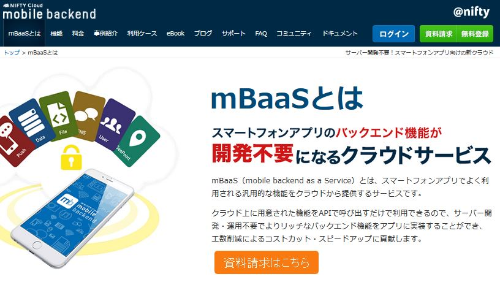

# Monaca x NIFTYCLOUD mobile backend データー登録サンプル

# 概要

こちらはMonacaを利用して、mbaasサーバーにデーター保存するサンプルです。
Monacaとmbaasに初めての方にお勧めです、5分ぐらいで、
monacaでデーター登録できるようにするサンプルGithubに公開しました。
ささっとインポートし、アプリキー、クライアントキーを変えるだけで、サーバにデーター登録することができます！
皆さんがこれから、サーバーにデーター保存したいなら、ぜひ活用してみてください！
例えば、スコア保存、スケジュール管理アプリのタスク保存など＾＾！

* Android, iOSアプリをHTML, JavaScriptで簡単に作れるツール[Monaca](https://ja.monaca.io/)
* アプリのサーバー機能を簡単に作れるツール[Nifty cloud mobile backend](http://mb.cloud.nifty.com/)

元の記事：[リンク](https://github.com/ncmbadmin/monaca_data_registration)


## 準備

* Monaca環境
* Nifty cloud mobile backend Javascript SDK version 2.1.1　ダウンロード：[Javascript SDK](http://http://mb.cloud.nifty.com/doc/current/introduction/sdkdownload_javascript.html?utm_source=community&utm_medium=referral&utm_campaign=sample_monaca_data_registration)
今回プロジェクトに組み込まれた状態でインポートしますので、自分でインストールする必要がありません。参考のため、インポート方法は下に説明します！

## 手順

* Monacaで新規アプリ作成し、プロジェクトをインポートする。
  - monacaの利用登録する
    [Monaca](https://ja.monaca.io/)

    
  - monacaで新規プロジェクトを作成する


  

* mobile backendでアプリ作成する
  - mobile backendで利用登録する
    [Nifty cloud mobile backend](http://mb.cloud.nifty.com/)

  - mobile backendでアプリ作成する: プロジェクトインポートを選択し、URLからインポートする。
 URLがhttps://github.com/ncmbadmin/monaca_data_registration/archive/master.zip
 で選択する。


* monacaで作成したアプリをmobile backendサーバーと連携させる
  - monacaでアプリキー、クライアントキーを設定し、初期化を行う
   


  - monacaで動作確認する


## 詳細説明

* コードの説明

```JavaScript
var appKey    = "YOUR_APPKEY";
var clientKey = "YOUR_KEY";
var ncmb = new NCMB(appKey, clientKey);

function startDemo() {
    var TestClass = ncmb.DataStore("TestClass");
    var testClass = new TestClass();
    var key   = "message";
    var value = "Hello, NCMB!";
    testClass.set(key, value);
    testClass.save()
        .then(function() {
            // 保存完了後に実行される
            alert("New object created with objectId: " + testClass.objectId);
        })
        .catch(function(error) {
            // エラー時に実行される
            alert("Failed to create new object, with error code: " + error.text);
        });
}
```
上記のコードでアプリケーションキーとクライアントキーを指定し、
NCMB(appKey, clientKey)　でmBaaSサーバと連携を行います。

"TestClass"という名前を設定してデータクラスを指定したあと、
testClassオブジェクトを利用して、データを操作できます。

```js
        var key   = "message";
        var value = "Hello, NCMB!";
        testClass.set(key, value);
```
testClassオブジェクトに対してkey, valueを設定した上でsave()を実行すると、非同期にてデータが保存されます。
また、データ保存に成功・失敗したとき実装はthen(), catch()で定義してあります。

# SDKインストール方法（済み）

最新SDKなっていない場合、以下ぜひご参考いただき、ご自身SDKを更新ください。


## 参考

サンプルコードをカスタマイズする、key, value変数を変更していただきます。
以下のドキュメントを参照し、データ保存・検索・プッシュ通知を入れることができる。
* [ドキュメント](http://mb.cloud.nifty.com/doc/current/)
* [ドキュメント・データストア](http://mb.cloud.nifty.com/doc/current/datastore/basic_usage_monaca.html)
* [ドキュメント・会員管理](http://mb.cloud.nifty.com/doc/current/user/basic_usage_monaca.html)
* [ドキュメント・プッシュ通知](http://mb.cloud.nifty.com/doc/current/push/basic_usage_monaca.html)

## 参考

* [Monaca](https://ja.monaca.io/)
* [mBaaS](http://mb.cloud.nifty.com/)
