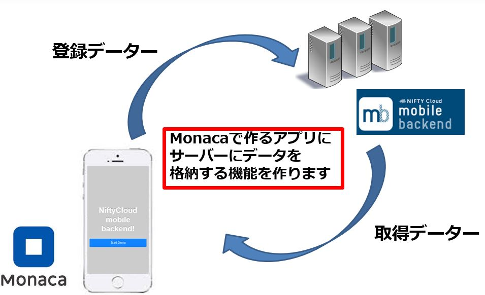
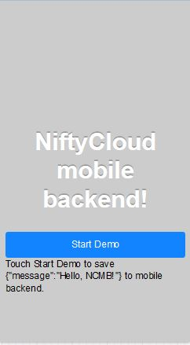
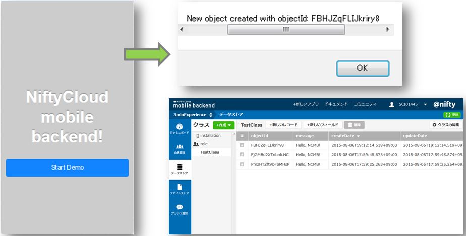
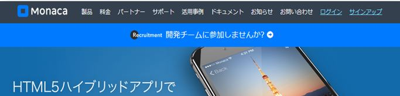
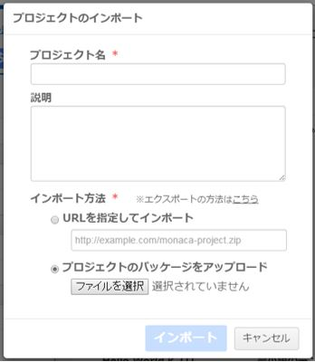
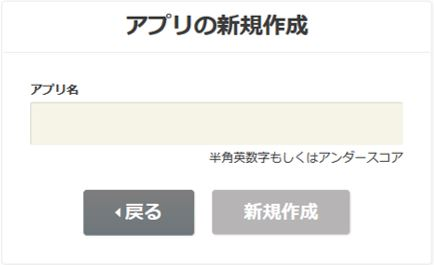
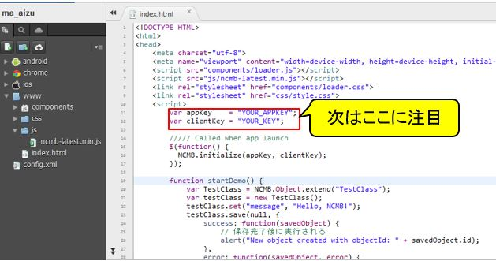
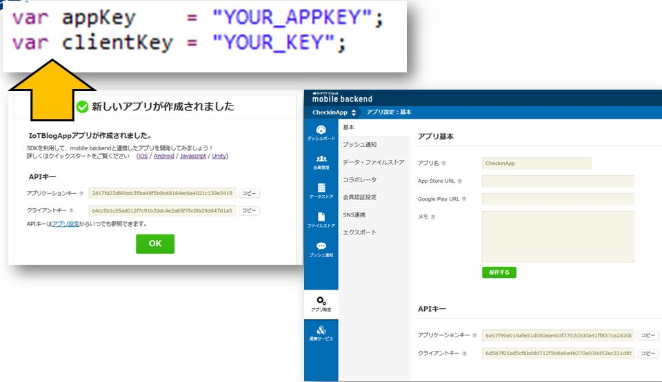

# Monaca x NIFTY Cloud mobile backend データ登録サンプル

===

# Overview

Monacaを用いて作ったアプリから、mobile backendへデータ登録・データ取得を行うサンプルコードとなります。
* HTML/CSS/JavaScriptでマルチプラットフォーム（iOS/Android/Windowsなど）にアプリを開発できる統合開発環境[Monaca](https://ja.monaca.io/)
* スマホアプリのサーバ側機能（プッシュ通知、会員管理、DBなど）をサーバ開発不要で実装できる[NIFTY Cloud mobile backend](http://mb.cloud.nifty.com/?utm_source=community&utm_medium=referral&utm_campaign=sample_monaca_data_registration)



## Demo

MonacaでgithubのURL（https://github.com/ncmbadmin/monaca_data_registration/archive/master.zip）をインポートし、
アプリケーションキーとクライントキーを設定してください。

アプリをプレビューしStartDemoボタンを押すと、mobile backendへデータが登録されます。
mobile backendのダッシュボードの「TestClass」クラスを開くことで、
「message」フィールドに「Hello, NCMB!」が保存されていることが確認できます。




## Requirement

* Monaca環境
* Nifty cloud mobile backend Javascript SDK version 2.0.0　ダウンロード：[Javascript SDK](http://http://mb.cloud.nifty.com/doc/current/introduction/sdkdownload_javascript.html?utm_source=community&utm_medium=referral&utm_campaign=sample_monaca_data_registration)

## Installation

* Monacaで新規アプリ作成し、プロジェクトをインポートする。
  - Monaca 利用登録
    [Monaca](https://ja.monaca.io/)
    
  - Monacaで新規プロジェクトを作成し、プロジェクトのインポートを選択します。
   
  - 「URLからインポートする」を選択し、URLに https://github.com/ncmbadmin/monaca_data_registration/archive/master.zip を指定します。
   

* mobile backendでアプリ作成する
  - mobile backend 利用登録
    [NIFTY Cloud mobile backend](http://mb.cloud.nifty.com/?utm_source=community&utm_medium=referral&utm_campaign=sample_monaca_data_registration)

  - mobile backendでアプリ作成する


* Monacaで作成したアプリをmobile backendサーバーと連携させる
  - アプリケーションキー、クライアントキーを設定し、初期化を行う
   

  - Monacaで動作確認する


## Description

* コードの説明

```JavaScript
var appKey    = "YOUR_APPKEY";
var clientKey = "YOUR_KEY";
var ncmb = new NCMB(appKey, clientKey);

function startDemo() {
    var TestClass = ncmb.DataStore("TestClass");
    var testClass = new TestClass();
    var key   = "message";
    var value = "Hello, NCMB!";
    testClass.set(key, value);
    testClass.save()
        .then(function() {
            // 保存完了後に実行される
            alert("New object created with objectId: " + testClass.objectId);
        })
        .catch(function(error) {
            // エラー時に実行される
            alert("Failed to create new object, with error code: " + error.text);
        });
}
```
上記のコードでアプリケーションキーとクライアントキーを指定し、
NCMB(appKey, clientKey)　でmBaaSサーバと連携を行います。

"TestClass"という名前を設定してデータクラスを指定したあと、
testClassオブジェクトを利用して、データを操作できます。
```
        var key   = "message";
        var value = "Hello, NCMB!";
        testClass.set(key, value);
```
testClassオブジェクトに対してkey, valueを設定した上でsave()を実行すると、非同期にてデータが保存されます。
また、データ保存に成功・失敗したとき実装はthen(), catch()で定義してあります。

## Usage

サンプルコードをカスタマイズすることで、様々な機能を実装できます！
データ保存・データ検索・会員管理・プッシュ通知などの機能を実装したい場合には、
以下のドキュメントもご参考ください。

* [ドキュメント](http://mb.cloud.nifty.com/doc/current/?utm_source=community&utm_medium=referral&utm_campaign=sample_monaca_data_registration)
* [ドキュメント・データストア](http://mb.cloud.nifty.com/doc/current/sdkguide/javascript/datastore.html?utm_source=community&utm_medium=referral&utm_campaign=sample_monaca_data_registration)
* [ドキュメント・会員管理](http://mb.cloud.nifty.com/doc/current/sdkguide/javascript/user.html?utm_source=community&utm_medium=referral&utm_campaign=sample_monaca_data_registration)
* [ドキュメント・プッシュ通知](http://mb.cloud.nifty.com/doc/current/sdkguide/javascript/push.html?utm_source=community&utm_medium=referral&utm_campaign=sample_monaca_data_registration)

## Contributing

1. Fork it!
2. Create your feature branch: `git checkout -b my-new-feature`
3. Commit your changes: `git commit -am 'Add some feature'`
4. Push to the branch: `git push origin my-new-feature`
5. Submit a pull request :D

## License

* MITライセンス
* NIFTY Cloud mobile backendのJavascript SDKのライセンス
